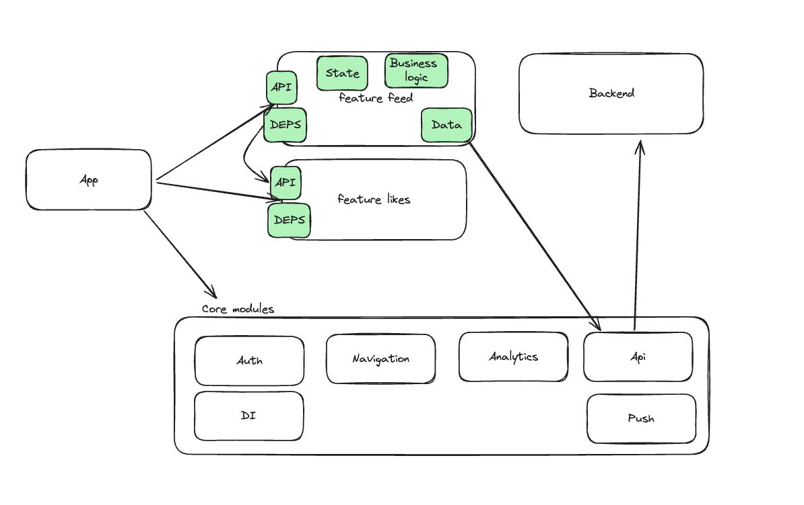
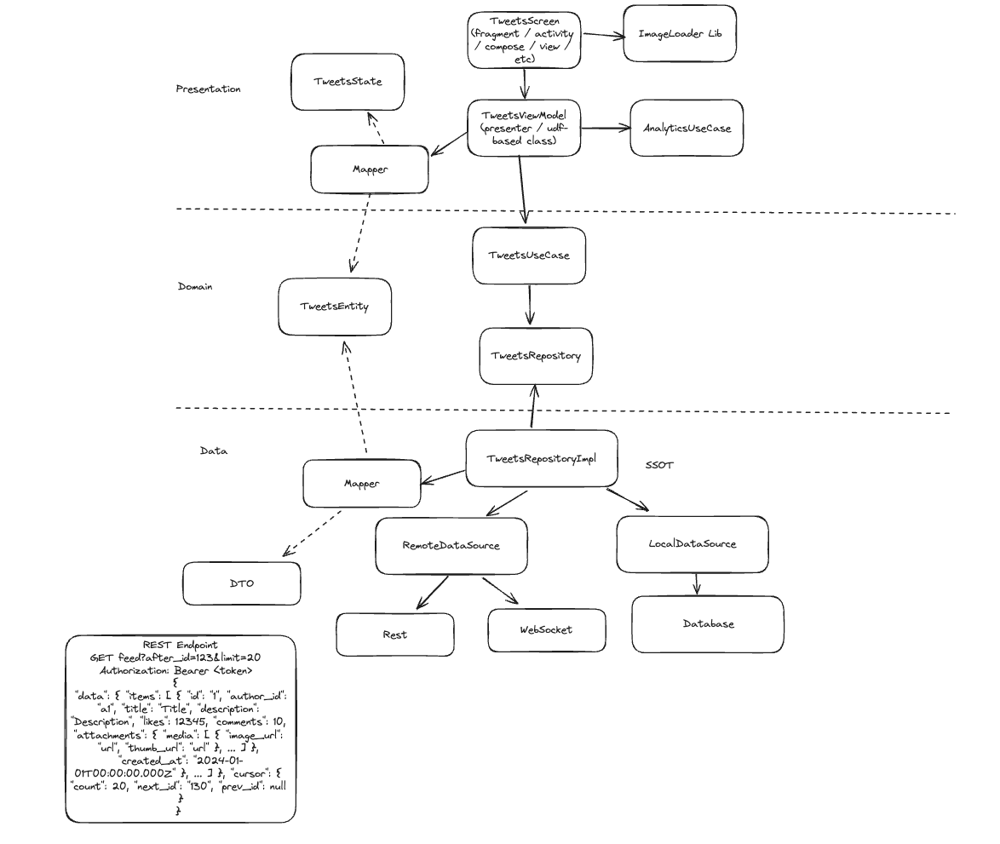

# Фреймворк для прохождения Mobile System Design Interview
Ниже приведен фреймворк для прохождения собеседований по проектированию систем с упором на мобильную разработку. В качестве примера будет проектирована лента твиттера. Предлагаемое решение далеко от совершенства, но не в этом суть собеседования по проектированию систем: никто не ожидает, что вы создадите надежную систему всего за 30 минут - интервьюер в основном ищет конкретные “сигналы” из вашего мыслительного процесса и коммуникаций, которые помогают оценить вас как кандидата. На что интервьюер может обращать внимание, будет рассмотрено в каждой главе.

## Зачем этот форк?
Мне не нравится некоторые куски оригинального репозитория, а именно его конечный результат — спроектированные диаграммы. Я считаю их некачественными. Неясно, зачем вводятся те или иные компоненты и как они связаны. Кроме того, некоторые компоненты излишни или вообще не нужны (например, DI Graph, Coordinator).


Доклад с мобиуса “Как пройти архитектурную секцию собеседования” рассматривает лишь проектирование конкретного модуля конкретной фичи с заранее предлагаемый MV* паттерном: почему так? Как устроены остальные фичи? Как устроена связь между фичами? Как устроена многомодульность? Как пройти секцию, если тебя просят спроектировать библиотеку?

Я перевел оригинальный фреймворк и дополнил его фича-модульной и чистой архитектурой, а также рядом своих мыслей по прохождению данной секции.


## Дисклеймер
Знание данного фреймворка не гарантирует прохождение интервью. Структура процесса собеседования зависит от личного стиля интервьюера. Не делайте предположений на собеседовании и задавайте уточняющие вопросы. Убедитесь, что вы понимаете, что хочет услышать интервьюер.

## Процесс интервью (45–60 минут)
- 2–5 минут — знакомство;
- 5 минут — постановка задачи и сбор требований;
- 10-15 минут — проектирование и обсуждение высокоуровневой архитектуры;
- 20-30 минут — погружение в детали;
- 5 минут — ваши вопросы интервьюеру.

## Знакомство
Интервьюер рассказывает о себе, затем вы. На этой секции лучше построить рассказ о себе коротким, четким и простым. Например: "Я Артур, мобильный разработчик во ВКонтакте, разрабатываю как продуктовые треки, так и инструменты для разработчиков. Последние полгода был фиче-лидом команды мультиаккаунта: в мои обязанности входило проектирование системы, планирования, технический мониторинг и непосредственная разработка".
Единственная цель знакомства на данном интервью — расслабить вас и кратко рассказать о вашем коммерческом опыте. Чем больше времени вы потратите на это, тем меньше времени у вас останется на само собеседование.

## Постановка задачи
Интервьюер ставит задачу, например: "*Спроектируй Twitter*".  Ваш первый шаг - определить масштаб задачи:
- **Только клиенсткое приложение**: есть бэкенд и известен API.
- **Клиенсткое приложение + API** : встречается чаще всего, вам нужно разработать клиентское приложение и API.
- **Клиенсткое приложение + API + Backend**: менее вероятный выбор, поскольку у большинства мобильных инженеров не было надлежащего опыта работы с Backend'ом.

## Сбор требований
Требования к задаче разделяются на **функциональные**, **нефункциональные** и **требования, выходящие за рамки задачи**.  Обозначим требования для задачи проектирования Twitter'a:
### Функциональные требования:
Подумайте о 3-5 функций, которые _принесут наибольшую ценность бизнесу_.
- пользователи должны иметь возможность прокручивать бесконечный список твитов;
- пользователи должны иметь возможность лайкнуть твит;
- пользователи должны иметь возможность открыть конкретный твит и посмотреть комментарии (только чтение).

### Нефункциональные требования
Не сразу видны пользователю, но играет важную роль для продукта в целом.
- оффлайн режим;
- real-time обновления;
- оптимальное использование мощностей процессора, батареи и интернет-трафика.

### Выходит за рамки
Функции, которые будут исключены из задачи, но все равно будут важны в реальном проекте.
- авторизация;
- отправка твита;
- подписки, ретвиты;
- аналитика;
- навигация.

### Советы
Вопросы о проектировании систем обычно двусмысленные. Интервьюеру больше интересно увидеть ваш мыслительный процесс, чем реальное решение, которое вы предлагаете:
- какие предположения о работе системы вы сделали и как вы их сформулировали?
- какие функции вы выбрали?
- какие уточняющие вопросы задали?
- о каких потенциальных проблемах и компромиссах вы упомянули?

Лучше всего задавать много вопросов и охватить как можно больше информации. Дайте понять, что вы начинаете копать в ширь, и спросите, в какую тему интервьюер хотел бы погрузиться больше.

## Уточняющие вопросы и дополнительный контекст
Вот некоторые из вопросов, которые можно задать на этапе разъяснения задачи:
- **нужно ли нам поддерживать развивающиеся рынки?** Публикация в развивающейся стране сопряжена с дополнительными трудностями. Размер приложения должен быть как можно меньше из-за широкого использования недорогих устройств и более высокой стоимости сотового трафика. Само приложение должно ограничивать количество и частоту сетевых запросов и в значительной степени полагаться на кэширование.
- **какое количество пользователей ожидается?** Это кажется странным вопросом для мобильного инженера, но он может быть очень важным: большое количество клиентов приводит к более высокой нагрузке на серверную часть - если вы неправильно разработаете свой API, вы можете легко инициировать DDoS-атаку на свои собственные серверы. Обязательно обсудите с вашим интервьюером подходы по exponential backoff и API rate-limiting.
- **какой размер команды ожидается?** Этот вопрос может иметь смысл для кандидатов уровня senior и выше. Создание продукта небольшой командой (2-4 инженера) сильно отличается от создания его более крупной командой (20-100 инженеров). Основная проблема заключается в структуре проекта и модульности. Вам нужно спроектировать свою систему таким образом, чтобы над ней могли комфортно работать много человек.

## Высокоуровневая диаграмма
По окончании этапа сбора и уточнения требований спросите, нужно ли спроектировать высокоуровневую диаграмму компонентов. Вот как она может выглядеть:


### Анатомия фича-модульной архитектуры:
Классический вариант проектирования приложения — фича-модульная архитектура, рассмотрим ее компоненты:
- **Feature API**: публичный интерфейс взаимодействия с фичей, например UseCase, возвращающих список всех твитов; router, позволяющий открывать твит по его id. Важно: API не навязывает наружу никакие фреймворки, DI, MV* паттерны, в идеале без платформенных зависимостей для возможности интеграции кроссплатформенных решений;
- **Feature Deps**: зависимости фичи на другие фичи, например, на UseCase, позволяющий лайкнуть твит по его id. Важно: фичи не связаны напрямую, фича подключает только публичный интерфейс другой фичи. Имплементации фичей подключается только в Application. В противном случае мы нарвемся на циклические зависимости, невозможность подмены реализации, ухудшение скорости сборки;
- **Feature State**: UI state фичи — MVx паттерны, чистые функции, сохранение состояния;
- **Feature Business logic**: скорее всего чистая архитектура, UseCases, Interactors.

#### Дисклеймер про чистую архитектуру
Все понимают чистую архитектуру по-разному: 5 разных разработчиков приведут 5 разных реализаций, поэтому клин - это маяк и ориентир для разработчиков, нам важно взять принципы чистой архитектуры: независимая бизнес-логика (domain слой), и presentation и data слой зависят от нее, тем самым мы получаем, в идеале, независимость от UI фреймворка, от баз данных, получаем тестируемость, переиспользуемость, задел на кроссплатфрому. А конкретная реализация клина зависит от компании или даже команды.

Остальные компоненты архитектуры:
- **Feature Data**: вся грязь, походы на бэкенд, в хранилища и т.д.
- **Core modules**: ряд ключевых модулей, не разделяемых api/impl: авторизация, навигация, аналитика, слой работы с бэкендом и прочее.
- **Backend**: rest / graphql / websockets / sse / etc...
- **App**: точка входа в приложение, подключает в себя все модули, настройвает core модули, показывает первую UI фичу приложения.

**Объяснение иерархии модулей** и их интеграцию с DI можно найти по [ссылке](https://youtu.be/VIg5LN08M1E?si=YVO2jyynkb_y7gwK).


### На что обращают внимание
- кандидат может представить “общую картину”, не перегружая ее ненужными деталями реализации;
- кандидат может определить основные строительные блоки системы и то, как они взаимодействуют друг с другом;
- кандидат учитывает модульность приложения и способен мыслить в рамках всей команды, а не ограничивать себя как единственного участника.

#### Зачем рисовать высокоуровневую диаграмму? Можно пропустить и рисовать сразу детализированную?
Рисование высокоуровневой диаграммы необязательно, можно выбрать другой подход, более подходящий к конкретному собеседованию. Однако, есть преимущества такого подхода:
- **Time management**: рисование вида с большой высоты выполняется быстро и дает непосредственные темы для дальнейшего обсуждения.
- **Модульность**: каждый высокоуровневый компонент потенциально может быть изолирован в отдельном модуле, что позволяет команде инженеров работать над проектом одновременно
- Этот подход широко используется для проектирования backend систем и очень похож на [C4 model for visualising software architecture](https://c4model.com/).

*Не уверены, нужно ли рисовать*? Спросите своего интервьюера, нужно ли рисовать высокоуровневую диаграмму или можно пропустить ее и перейти к каким-то конкретным компонентам.

## Детальное погружение в фичу ленты твитов
После обсуждения высокоуровневой архитектуры будет обсуждаться конкретный компонент системы. Предположим, это конкретная фича списка твитов. Вещи, о которых вы, возможно, захотите поговорить:
- **архитектурные паттерны слоя представления**: MV*, лучше выбрать хорошо известный вам паттерн, поскольку это облегчает привлечение новых сотрудников;
- **пагинация** для функциональности бесконечной загрузки, см. этот раздел ниже.
- **чистая архитектура** для переиспользуемости бизнес-логики
- **коммуникация с другими фичами**: использование сущностей других модулей внутри вашего модуля, например аналитили, библиотеки для загрузки картинок;
- **single source of truth**: для избавления от неконсистентности данных и поддержки оффлайн режима;
- **mappers**: расположение по слоям.



### Компоненты
- **TweetsScreen**: UI фичи, может быть построен как на Activity, Fragments, Compose, UI Kit, SwiftUI — подход не так важен.
- **TweetsViewModel**: сущность, работающая с состоянием UI, может быть выбьран любой другой подход — MVP, MVI, TEA, etc.
- **Mappers**: мапперы из DTO в Entity, из Entity в UI State.
- **AnalyticsUseCase**, **ImageLoader** API: зависимости из внешних модулей или библиотек.
- **TweetsUseCase, TweetsEntity**: Ключевые сущности бизнес-логики, предполагают переиспользование и полную независимость.
- **TweetsRepository** & **TweetsRepositoryImpl**: интерфейс репозитория выступает как сущность бизнес-логики, имплементация — сущность data слоя и SSOT. См. дисклеймер по реализации чистой архитектуры.
- **RemoteDataSource**, **REST**, **WebSocket**: сущности для работы с бэкендом. Конкретный выбор будет обоснован ниже.
- **LocalDataSource**, **Database**: сущности для кэширования данных. Конкретный выбор будет обоснован ниже.

### На что обращают внимание
- кандидат знаком с наиболее распространенными шаблонами MVx;
- кандидат добивается четкого разделения между бизнес-логикой и пользовательским интерфейсом;
- кандидат знаком с методами внедрения зависимостей;
- кандидат способен проектировать автономные изолированные модули.

### Часто задаваемые вопросы
#### Как глубоко нужно погружаться?
Здесь нет эмпирического правила. Работайте в тесном контакте с интервьюером: спросите его, нужно ли вам углубиться или перейти к следующей теме. Если у вас видеоинтервью - следите за выражением его лица. Например, если вы видите, что интервьюер хочет вас прервать - прекратите говорить и спросите, есть ли у него какие-либо вопросы. Весь смысл в совместной работе - это хороший сигнал для вас как командного игрока / сотрудника.
#### Почему не упоминаются конкретные классы (например, RecyclerView или UICollectionView) или библиотеки (например, Room, CoreData, Realm и другие)?
- чтобы сделать руководство стабильным и не зависящим от платформы: библиотеки и фреймворки постоянно развиваются - выбор конкретного инструмента может быть актуален только в течение короткого периода времени. Использование абстракции более надежно, поскольку вы концентрируетесь только на функциональности, которую она предоставляет, не слишком углубляясь в детали реализации;
- выбор библиотек является предвзятым и зависит от личного опыта и текущих тенденций;
- биг тех компании обычно пишут свои решения;
- в Интернете уже есть масса подробностей, касающихся конкретных реализаций;

#### Какой инструмент рисования использовать?
На момент написания этой статьи наиболее популярными могли бы быть [Excalidraw](https://excalidraw.com/), [Google Jamboard](https://jamboard.google.com/), [Miro](https://miro.com). Некоторые интервьюеры вообще отказались бы от составления диаграмм и предпочли бы совместную работу редактора и устное обсуждение. Из-за проблем с конфиденциальностью некоторые компании не разрешают кандидату пользоваться экраном и использовать инструмент по личному выбору.

## Проектирования Backend API
Цель состоит в том, чтобы охватить как можно больше информации - у вас не будет достаточно времени, чтобы охватить каждый вызов API - просто спросите интервьюера, интересует ли его конкретная часть, или выберите то, что вы знаете лучше всего (в случае, если у компании нет сильных предпочтений).
### Real-time
Нам необходимо обеспечить поддержку уведомлений в режиме реального времени как часть дизайна. Ниже приведены некоторые из подходов, которые можно упомянуть в ходе обсуждения:
- **Push Notifications**:
  - плюсы:
    - сервисы предоставляют решение из коробки;
    - можно "пробудить" приложение в фоне.
  - минусы:
    - не на 100% надежен;
    - получение может занимать неограниченное количество времени;
    - зависимость на сторонние сервисы;
    - пользователи могут отключить получение.
- **HTTP-polling** Polling требует, чтобы клиент периодически запрашивал у сервера обновления. Наибольшую озабоченность вызывает объем ненужного сетевого трафика и повышенная нагрузка на серверную часть.
  - **short polling**: клиент запрашивает данные с сервера с заранее определенным интервалом времени.
    - плюсы:
      - просто и не так дорого (если время между запросами большое).
      - не нужно держать постоянное соединение
    - минусы:
      - иммитация real-time;
      - дополнительные расходы на TLS Handshake и HTTP-headers
  - **long polling**:
    - плюсы:
      - мгновенное уведомление (без дополнительной задержки).
    - минусы:
      - более сложный и требующий больше серверных ресурсов.
      - сохраняет постоянное соединение до тех пор, пока сервер не ответит.
- **Server-Sent Events** Позволяет клиенту передавать события по HTTP-соединению без polling'a.
  - плюсы:
    - real-time трафик с использованием одного соединения.
  - минусы:
    - держит постоянное соединение.
- **Web-Sockets**:    
  Обеспечьте двунаправленную связь между клиентом и сервером.
  - плюсы:
    - может передавать как двоичные, так и текстовые данные.
  - минусы:
    - более сложный в настройке по сравнению с Polling/SSE.
    - держит постоянное соединение.

Интервьюер ожидает, что в итоге вы выберете **конкретный подход**, наиболее подходящий для текущей задачи проектирования. Одним из возможных решений дизайна твиттер ленты могло бы быть использование комбинации SSE (основного канала получения обновлений о “лайках” в режиме реального времени) с Push-уведомлениями (отправляемыми, если у клиента нет активного подключения к серверной части).

### Протоколы
#### REST
Текстовый протокол без сохранения состояния - самый популярный выбор для операций CRUD (Создание, чтение, обновление и удаление).
- плюсы:
  - простой в изучении, понимании и имплементации
  - легко кэшируется с помощью встроенного механизма HTTP-кэширования.
  - слабая связанность (coupling) между клиентом и сервером.
- минусы:
  - менее эффективен на мобильных платформах, поскольку для каждого запроса требуется отдельное физическое соединение.
  - без схемы - трудно проверить достоверность данных на клиенте.
  - без сохранения состояния - требуется дополнительная функциональность для поддержания сеанса.
  - дополнительные накладные расходы - каждый запрос содержит контекстные метаданные и заголовки.

#### GraphQL
Язык запросов для работы с API - позволяет клиентам запрашивать данные из нескольких ресурсов, используя одну конечную точку (вместо выполнения нескольких запросов в традиционных приложениях RESTful).
- плюсы:
  - типизированные запросы на основе схемы - клиенты могут проверять целостность и формат данных.
  - легко настраиваемый - клиенты могут запрашивать определенные данные и уменьшать объем HTTP-трафика.
  - двунаправленная связь с подписками GraphQL Subscriptions (на основе WebSocket).
- минусы:
  - более сложная серверная реализация..
  - “протекающая абстракция” - клиенты становятся тесно связанными с серверной частью.
  - производительность запроса привязана к производительности самого медленного сервиса на серверной части (в случае, если данные ответа объединены между несколькими сервисами/компонентами).

#### WebSocket
Полнодуплексная связь по одному TCP-соединению.
- плюсы:
  - двунаправленная связь в режиме реального времени.
  - обеспечивает как текстовый, так и двоичный трафик.
- минусы:
  - требует поддержания активного соединения - может привести к снижению производительности в нестабильных сетях сотовой связи.
  - без схемы - трудно проверить достоверность данных на клиенте.
  - количество активных подключений на одном сервере ограничено 65 тысячами.

Подробно про WebSocket'ы:
- [WebSocket Tutorial - How WebSockets Work](https://www.youtube.com/watch?v=pNxK8fPKstc)

#### gRPC
Платформа удаленного вызова процедур, которая работает поверх HTTP/2. Поддерживает двунаправленную потоковую передачу с использованием одного физического соединения.
- плюсы:
  - облегченные двоичные сообщения (намного меньшего размера по сравнению с текстовыми протоколами).
  - основанная на схеме - встроенная генерация кода с помощью Protobuf.
  - обеспечивает event-driven архитектуру: потоковая передача на стороне сервера, потоковая передача на стороне клиента и двунаправленная потоковая передача
  - поддержка нескольких параллельных запросов.
- минусы:
  - ограниченная поддержка браузерами.
  - формат, не читаемый человеком.

The interviewer would expect you to **pick a concrete approach** most suitable for the design task at hand. Since the API layer for the "Design Twitter Feed" question is pretty simple and does not require much customization - we can select an approach based on REST.  
Интервьюер ожидает, что в итоге вы выберете **конкретный подход**, наиболее подходящий для текущей задачи проектирования. Поскольку дизайн API твиттера ленты довольно прост и не требует большого количества кастомизации, можно выбрать REST.

### Пагинация
Эндпоинты, возвращающие список объектов, должны поддерживать постраничную загрузку. Без пагинации один запрос может вернуть огромное количество результатов, что приведет к чрезмерному использованию сети и памяти.
#### Типы пагинации
- **Offset** Предоставляет `limit` и `offset` параметры. Пример: `GET /feed?offset=100&limit=20`.
  - плюсы:
    - проще всего реализовать - параметры запроса могут быть переданы непосредственно в SQL-запрос.
    - без сохранения состояния на сервере.
  - минусы:
    - плохая производительность при больших значениях смещения (базе данных необходимо пропустить строки "смещения", прежде чем возвращать результат с разбивкой на страницы).
    - несогласованное состояние при добавлении новых строк в базу данных (page drifting).
- **Keyset** Использует значения с последней страницы для извлечения следующего набора элементов. Пример: `GET /feed?after=2021-05-25T00:00:00&limit=20`.
  - плюсы:
    - легко преобразуется в SQL-запрос.
    - хорошая производительность при работе с большими наборами данных.
    - без сохранения состояния на сервере.
  - минусы:
    - "протекающая абстракция" - пагинация получает информацию о базовом хранилище базы данных
    - работает только с полями с естественным упорядочением (timestamps и т.д.).
- **Cursor/Seek** Работает со стабильными идентификаторами, которые не связаны с SQL-запросами базы данных (обычно выбранное поле кодируется с использованием base64 и шифруется на серверной стороне). Пример: `GET /feed?after_id=t1234xzy&limit=20`.
  - плюсы:
    - отделяет разбиение на страницы от базы данных SQL.
    - последовательный и корректный порядок при вставке новых элементов.
  - минусы:
    - более сложная серверная реализация.
    - не работает должным образом, если элементы удаляются (идентификаторы могут стать недействительными).

Вам нужно выбрать конкретный подход после перечисления возможных вариантов и обсуждения их плюсов и минусов. Для ленты новостей/твитов лучше всего подходит Cursor Pagination:
```  
GET /v1/feed?after_id=p1234xzy&limit=20  
Authorization: Bearer <token>  
{  
 "data": { "items": [ { "id": "t123", "author_id": "a123", "title": "Title", "description": "Description", "likes": 12345, "comments": 10, "attachments": { "media": [ { "image_url": "https://static.cdn.com/image1234.webp", "thumb_url": "https://static.cdn.com/thumb1234.webp" }, ... ] }, "created_at": "2021-05-25T17:59:59.000Z" }, ... ] }, "cursor": { "count": 20, "next_id": "p1235xzy", "prev_id": null }}  
```  
#### Дополнительная информация
- [Evolving API Pagination at Slack](https://slack.engineering/evolving-api-pagination-at-slack/)
- [Everything You Need to Know About API Pagination](https://nordicapis.com/everything-you-need-to-know-about-api-pagination/)

Хотя мы оставили это за рамками, все равно полезно упомянуть HTTP-аутентификацию. Вы можете включить заголовок авторизации и обсудить, как правильно обрабатывать сценарий ответа `401 (Unauthorized)`. Кроме того, не забудьте поговорить о стратегиях ограничения скорости (Rate-Limit) (`429 Too Many Requests`).
Постарайтесь, чтобы это было кратко и просто (без лишних деталей): ваша основная цель во время собеседования по проектированию системы - дать понять, что вы знаете про это и будете учитывать, а не создать готовое к производству решение.

### На что обращают внимание
- Кандидат осведомлен о проблемах, связанных с плохим состоянием сети и дорогим трафиком.
- Кандидат знаком с наиболее распространенными протоколами для однонаправленной и двунаправленной связи.
- Кандидат знаком с RESTful дизайном API.
- Кандидат знаком с лучшими практиками аутентификации и обеспечения безопасности.
- Кандидат знаком с обработкой сетевых ошибок и ограничением скорости.

## Data Storage
### Варианты
Ниже приведены наиболее распространенные варианты хранения данных на локальном устройстве:
- **Key-Value Storage (UserDefaults/SharedPreferences/Property List)**:    
  Обычно обрабатывается с помощью XML или бинарных файлов. Позволяет связывать примитивные данные с ключами на основе строк. Лучше всего работает с простыми, неструктурированными, конфиденциальными данными (настройки, флаги и т.д.).
  - плюсы:
    - легко использовать встроенное API.
  - минусы:
    - небезопасно (Android предоставляет [EncryptedSharedPreferences](https://developer.android.com/reference/androidx/security/crypto/EncryptedSharedPreferences); доступны 3rd party бибилотеки на ios).
    - не подходит для хранения больших объемов данных.
    - нет поддержки схемы и возможности запрашивать данные.
    - нет поддержки миграции данных.
    - низкая производительность.
- **Database/ORM (sqlite/Room/Core Data/Realm/etc)**:    
  Основан на реляционной базе данных. Идеально подходит для больших объемов структурированных данных, требующих сложной логики запросов.
  - плюсы:
    - поддержка объектно–реляционного отображения.
    - поддержка схемы и запросов.
    - поддержка миграции данных.
  - минусы:
    - более сложная настройка.
    - небезопасно (есть библиотеки-обертки с поддержкой шифрования на iOS/Android).
    - больший объем памяти.
- **Custom/Binary (DataStore/NSCoding/Codable/etc)**:    
  Обрабатывает хранение и загрузку данных на низком уровне. Лучше всего работает, когда вам нужно настроить пайплайн хранения данных.
  - плюсы:
    - кастомизируемый.
    - производителньый.
  - минусы:
    - нет поддержки схемы/миграции.
    - много ручных усилий.
- **On-Device Secure Storage (Keystore/Key Chain)**:    
  Используйте зашифрованное операционной системой хранилище для создания/хранения ключей шифрования и данных о значении ключа.
  - плюсы:
    - безопасно (не на 100%, если это не предусмотрено аппаратным обеспечением).
  - минусы:
    - не оптимизирован для хранения чего-либо, кроме ключей шифрования.
    - накладные расходы на производительность шифрования/дешифрования.
    - нет поддержки схемы/миграции.
### Расположение хранилище
- **Внутреннее хранилище приложения**    
  Изолирован приложением и недоступен для чтения другими приложениями (за редким исключением).
- **Хранилище вне приложения**    
  Общедоступный и, скорее всего, не будет удален при удалении вашего приложения.
- **Media/Scoped**    
  Специальный тип хранилища для медиафайлов.
### Тип хранилища
- **Документы (с автоматическим бэкапом)**    
  Созданные пользователем данные, которые не могут быть легко сгенерированы повторно и будут автоматически созданы резервные копии.
- **Кэш**    
  Данные, которые могут быть загружены повторно или восстановлены заново. Могут быть удалены пользователем для освобождения места.
- **Временное**    
  Данные, которые используются только временно и должны быть удалены, когда они больше не нужны.

### Лучшие практики
- Храните как можно меньше конфиденциальных данных.
- Используйте зашифрованное хранилище, если вы не можете избежать хранения конфиденциальных данных.
- Не позволяйте хранилищу приложений бесконтрольно увеличиваться. Убедитесь, что очистка кэшированных файлов не повлияет на функциональность приложения.

#### БД для хранения данных о твитах
Создаем таблицу базы данных “feed” для хранения ответа и поддержки оффлайн режима:
```  
item_id:        String  
author_id:      String  
title:          String  
description:    String  
likes:          Int  
comments:       Int  
attachments:    String # список, разделенный запятыми  
created_at:     Date   # также используется для сортировки  
cursor_next_id: String # указывает курсором на следующую страницу
cursor_prev_id: String # указывает на предыдущую страницу курсора 
```  
- Ограничьте общее количество записей до 500, чтобы контролировать размер локального хранилища.
- Flatten attachments into a comma separated list. Alternatively, you can create an `attachments` table and join it with the `feed` table on `item_id`.
- Храните вложения (attachments) в списке, разделенный запятыми. В качестве альтернативы можно создать таблицу вложений и объединить ее с таблицей `feed` по `item_id`.
- Явно сохраняйте идентификатор курсора next/prev для каждого элемента, чтобы упростить навигацию по страницам.

#### Хранение вложений
- Храните вложения в виде файлов во внутреннем кэшированном хранилище.
- Используйте URL-адреса вложений в качестве ключей кэша.
- Удалите вложения после удаления соответствующих элементов из таблицы `feed`.
- Ограничьте размер кэша до 200-400 Мб.

### На что обращают внимание
- Кандидат осведомлен о типах хранилищ, безопасности, ограничениях и совместимости.
- Кандидат способен разработать решение для хранения данных для большинства распространенных сценариев.

## Дополнительные темы
### Основные проблемы, связанные с мобильной разработкой
Вот список проблем, которые следует иметь в виду при обсуждении вашего решения с интервьюером:
- **Конфиденциальность пользовательских данных** - утечка клиентских данных может нанести ущерб вашему бизнесу и репутации.
- **Безопасность** - защитите свои продукты от reverse-engeneering'f (что более важно для Android).
- **Новые версии операционных систем** - каждая новая версия iOS /Android может ограничивать существующую функциональность и ужесточать правила конфиденциальности.
- **Необратимость каждого релиза** - предполагайте, что все, что вы публикуете в сторах, является окончательным и никогда не изменится. Обязательно используйте поэтапные развертывания и “feature”-флаги на стороне сервера.
- **Performance/Стабильность**
- **Ограниченное использование данных** - трафик сотовой сети может быть очень дорогим.
- **Загрузка процессора** - более высокая вычислительная нагрузка приводит к более быстрому разряду батареи и перегреву устройства.
- **Использование памяти** - более высокое использование памяти увеличивает риск того, что приложение будет закрыто в фоновом режиме.
- **Время запуска** - выполнение слишком большого объема работы при запуске приложения ухудшает опыт пользователя.
- **Crashes/ANRs** - выполнение слишком большого объема работы в основном потоке может привести к закрытию приложения и сбоям в пользовательском интерфейсе. Сбои приложений - основной фактор низких рейтингов магазинов.
- **Использование геолокации**
- Не ставьте под угрозу конфиденциальность пользователей при использовании геолокационных сервисов.
- Предпочитайте минимально возможную точность определения местоположения. При необходимости постепенно запрашивайте повышение точности определения местоположения.
- Предоставьте обоснование доступа к местоположению, прежде чем запрашивать разрешения.
- **Использование 3rd-Party SDKs**
- сторонние SDK могут привести к снижению производительности и/или серьезным сбоям в работе ([пример](https://www.bugsnag.com/blog/sdks-should-not-crash-apps)).
  - Каждый SDK должен быть защищен feature-флагом.
  - Новая интеграция SDK должна быть внедрена в качестве A/B-теста или поэтапного внедрения.
  - У вас должен быть план “поддержки и обновления” для сторонних SDK на долгосрочную перспективу.

### Конфиденциальность и безопасность
- Храните как можно меньше пользовательских данных - не собирайте то, что вам не понадобится.
  - Избегайте сбора идентификаторов устройств (предпочитайте одноразовые псевдоанонимные идентификаторы).
  -   Анонимизируйте собранные данные.
- Сведите к минимуму использование пермишенов
  - Будьте готовы к тому, что пользователь откажет в разрешениях, и уважайте выбор пользователя, когда он откажет в разрешении во второй раз.
  - Будьте готовы к тому, что система автоматически сбросит разрешения.
  - Будьте готовы к переходу неиспользуемых приложений в спящий режим.
  - Делегируйте функциональность сторонним приложениям на устройстве (камера, средство выбора фотографий, файловый менеджер и т.д.).
- Предполагайте, что хранилище на устройстве небезопасно (даже при использовании Keystore/Keychain).
- Предполагайте, что серверное хранилище также небезопасно - обсуждались возможные механизмы сквозного шифрования.
- Предполагайте, что правила безопасности и конфиденциальности платформы (iOS/Android) изменятся - сделайте критическую функциональность управляемой с помощью feature-флагов.
- *Восприятие* безопасности пользователем так же важно, как и применяемые меры безопасности - обязательно обсудите, как вы будете обучать своих клиентов сбору, хранению и передаче данных.

#### Работа в облаке vs работа на устройстве
В какой-то момент во время собеседования вам, возможно, придется выбирать между запуском некоторых функций на устройстве и переносом их в облако. Выбранный вами подход окажет наибольшее влияние, когда речь заходит об ИИ на устройстве, но также может быть распространен на любой вид обработки данных.

**Преимущества работы в облаке:**
- Независимость от устройства - ваши клиенты не ограничены характеристиками своих устройств.
- Лучшее использование ресурсов клиентской системы - любые интенсивные вычисления могут выполняться на серверной части для экономии заряда батареи устройства.
- Быстрый темп изменений - вам не нужно выпускать обновление для всех клиентов, чтобы получить доступ к желаемой функциональности.
- Гораздо большие вычислительные ресурсы - ваш серверный сервер может автоматически масштабироваться по мере роста нагрузки.
- Повышенная безопасность - клиентский код может быть изменен и подвергнут обратной инженерии, в то время как серверные приложения, как правило, более безопасны.
- Упрощенная аналитика и анализ данных в автономном режиме - вы собираете все необходимые вам данные в своих центрах обработки данных.

**Преимущества работы на устройстве**
- Лучшая конфиденциальность - данные не покидают устройство пользователя и не хранятся в облаке.
- Функциональность в режиме реального времени - некоторые операции могут выполняться на устройстве пользователя намного быстрее, чем при отправке на серверную часть.
- Меньше использования пропускной способности - вам не нужно отправлять данные по сети.
- Offline функциональность - для работы клиенту не требуется постоянное сетевое подключение.
- Меньшее использование серверной части - нагрузка распределяется между всеми клиентами и серверной частью.

**Вещи, которые вы никогда не должны запускать на устройстве**
- Создание нового “ресурса” - генерация купонов, билетов и т.д.
- Транзакции и проверка платежа - если только это не делегировано стороннему SDK.

### Offline State
Добавление offline режима обеспечивает удобство использования приложения без подключения к сети:
- пользователь может ставить лайки / комментировать / удалять твиты без подключения к сети.
- пользовательский интерфейс обновляется, предполагая, что каждый запрос будет отправлен, когда сеть снова подключится к сети.
- приложение должно отображать кэшированные результаты, когда это возможно.
- приложение должным образом уведомляет пользователей о своем offline режиме.
- все изменения состояния группируются и отправляются, когда сеть снова подключается к сети.
#### Запрос на устранение дублирования
Клиент должен убедиться, что повторная попытка выполнения того же запроса не приведет к созданию дублирующего ресурса на сервере (идемпотентность). Возможное решение может включать уникальные идентификаторы запросов, сгенерированные на стороне клиента, и дедупликацию на стороне сервера.
#### Синхронизация локального и удаленного состояний
Следующий вопрос может потребовать от вас надлежащего управления синхронизацией состояния на нескольких устройствах с одной и той же учетной записью. Разрешение конфликта слиянием может быть сложным. Ниже приведены несколько возможных решений.

**Локальное разрешение конфликтов** Локальное устройство извлекает удаленное состояние из серверной части после выхода в Интернет, объединяет его с локальным состоянием и загружает изменения.

плюс: легко в реализации.
минусы:
- небезопасно - предоставляет локальному устройству полномочия над серверной частью.
- это не решит проблему, если несколько устройств отправляют свои обновления одновременно (последнее обновление “выигрывает”).
- любые изменения в логике слияния требуют обновления приложения.

**Удаленное разрешение конфликтов** Локальное устройство отправляет свое локальное состояние серверной части после выхода в Интернет, получает новое состояние и перезаписывает локальное состояние.

плюсы:
- переносит полномочия по разрешению конфликтов на серверную часть.
- не требует обновлений клиента.

минусы:
- более сложная серверная реализация.

#### Узнать больше
- Offline функциональность для мобильных приложений Trello:
  - [Airplane Mode: Enabling Trello Mobile Offline](https://tech.trello.com/sync-architecture/)
  - [Syncing Changes](https://tech.trello.com/syncing-changes/)
  - [Sync Failure Handling](https://tech.trello.com/sync-failure-handling/)
  - [The Two ID Problem](https://tech.trello.com/sync-two-id-problem/)
  - [Offline Attachments](https://tech.trello.com/sync-offline-attachments/)
  - [Sync is a Two-Way Street](https://tech.trello.com/sync-downloads/)
  - [Displaying Sync State](https://tech.trello.com/sync-indicators/)
### Caching
*В работе*
### Качество продукта (QA)
Чтобы сделать вашу систему более энергоэффективной, вы можете ввести классы качества обслуживания для ваших сетевых операций. Реализация довольно сложная, но вы можете обсудить ее на более высоком уровне:
- Ограничить количество параллельных сетевых операций (4-10). Количество может зависеть от состояния устройства (аккумулятор/зарядка, Wi-Fi/сотовая связь, режим ожидания и т.д.).
- Присвойте класс качества обслуживания каждому из ваших сетевых запросов:
  - **Критически важные для пользователя** - должны быть отправлены как можно быстрее: получение следующей страницы данных для ленты твитов; запрос подробной информации о твите.
  - **Критичный к пользовательскому интерфейсу** - должен отправляться после запросов, важных для пользователя: получение изображений с низким разрешением для твитов в ленте во время прокрутки. Отменяется, если пользователь прокручивает целевой твит. Может быть отложено в случае быстрой прокрутки.
  - **Не критичный к пользовательскому интерфейсу**: должен отправляться после запросов, важных для пользовательского интерфейса: получение изображений высокого разрешения для твитов в ленте. Отменяется, если пользователь прокручивает целевой твит. Может быть отложено в случае быстрой прокрутки.
  - **Фоновый**: должно быть отправлено после завершения всего вышеперечисленного: публикации “лайков”, аналитики.
- Внедрите приоритетную очередь для планирования сетевых запросов: отправляйте запросы в порядке их приоритета. Приостанавливайте запросы с низким приоритетом, если достигнуто максимальное количество одновременных операций и запланирован запрос с высоким приоритетом.
### Resumable Uploads (возобновляемые загрузки)
Возобновляемая (фрагментированная) загрузка мультимедиа разбивает один запрос на загрузку на три этапа:
- Инициализация загрузки
- Загрузка фрагментов байтов (добавление)
- Завершение загрузки


**Плюс подхода с resumable uploads:**
- Позволяет возобновить прерванные операции передачи данных без перезапуска с самого начала.

**Минус подхода с resumable uploads:**
- Накладные расходы, связанные с дополнительными подключениями и метаданными.

**Помните:** Resumble uploads наиболее эффективны при загрузке больших объемов (видео, архивов) в нестабильных сетях. Для файлов меньшего размера (изображений, текстов) и стабильных сетей должно быть достаточно загрузки по одному запросу.

#### Больше информации:
- [YouTube: Resumable Uploads](https://developers.google.com/youtube/v3/guides/using_resumable_upload_protocol)
- [Google Photos: Resumable Uploads](https://developers.google.com/photos/library/guides/resumable-uploads)
- [Google Cloud: Resumable Uploads](https://cloud.google.com/storage/docs/resumable-uploads)
- [Twitter: Chunked Media Upload](https://developer.twitter.com/en/docs/twitter-api/v1/media/upload-media/uploading-media/chunked-media-upload)

### Предзагрузка данных (prefetching)
Предзагрузка повышает производительность приложения, скрывая задержку передачи данных по медленным и ненадежным сетям. Самая большая проблема при реализации предзагрузки - это увеличение расхода батареи и данных сотовой связи.
_TBD_
#### Больше информации:
- [Optimize downloads for efficient network access](https://developer.android.com/training/efficient-downloads/efficient-network-access)
- [Improving performance with background data prefetching](https://instagram-engineering.com/improving-performance-with-background-data-prefetching-b191acb39898)
- [Informed mobile prefetching](https://dl.acm.org/doi/10.1145/2307636.2307651)
- [Understanding prefetching and how Facebook uses prefetching](https://www.facebook.com/business/help/1514372351922333)
## Заключение
Во время собеседования по проектированию систем существует значительная доля непредсказуемости. Процесс и структура могут варьироваться в зависимости от компании и интервьюера.
### Что вы можете контроллировать
- **Ваше отношение** - всегда будьте дружелюбны, независимо от того, как проходит собеседование. Не будьте назойливы и не спорьте с интервьюером - вам могут поставить низкую оценку.
- **Ваша подготовка** - чем лучше вы подготовитесь, тем больше шансов на положительный результат. Попрактикуйтесь и смотри мок собесы ([#1](https://youtu.be/OdEUqeJzrLA?si=cBRcZ3IvbR_Tjjy6), [#2](https://youtu.be/SD3N7vyJElc?si=BqprelNQKhKO7YTb), [найти людей](https://www.teamblind.com/search/mock)).
- **Ваши знания** - чем больше у вас знаний, тем больше у вас шансов.
  - получайте опыт.
  - изучайте популярые open source проекты: [iOS](https://github.com/search?q=iOS&type=Repositories), [Android](https://github.com/search?o=desc&q=Android&s=stars&type=Repositories)
  - читайте блоги разработчиков от технологических компаний::
    - [Uber](https://eng.uber.com/category/articles/mobile/)
    - Instagram: [iOS](https://instagram-engineering.com/tagged/ios), [Android](https://instagram-engineering.com/tagged/android)
    - [Trello](https://tech.trello.com/)
    - [Square](https://code.cash.app)
    - [Dropbox](https://dropbox.tech/mobile)
    - [Reddit](https://www.redditinc.com/blog/topic/technology)
    - [Airbnb](https://medium.com/airbnb-engineering/tagged/mobile)
    - [Lyft Tech Podcast](https://podcasts.apple.com/us/podcast/lyft-mobile/id1453587931)
    - [Curated List of Blog Posts](/BLOGPOSTS.MD)
- **Ваше резюме** - обязательно перечислите все свои достижения с измеримым эффектом.
### Что вы не можете контроллировать
- **Отношение вашего интервьюера** - у него может быть плохой день или вы ему просто не нравитесь.
- **Ваш конкурент** - иногда просто есть кандидат получше.
- **Комитет по найму** - они принимают решение на основе отчета интервьюеров и вашего резюме.
### Оценивая результат
You _can influence_ the outcome but you _can't control_ it. Don't let minor setbacks determine your self-worth.  
Вы *можете повлиять на результат*, но *не можете его контролировать*. Не позволяйте неудачам определять вашу самооценку.

## Часто задаваемые вопросы

### Откуда ты знаешь, что этот подход работает? Почему это важно?
- Данный фреймворк успешно протестирован на ряде российских IT компаний, в частности: Avito и Tinkoff
- Нет никакой гарантии, что предложенный подход будет хорошо работать во многих случаях - структура этапа проектирования системы зависит от личного стиля интервьюера.
- Наличие под рукой хорошего плана собеседования позволяет как интервьюеру, так и кандидату больше сосредоточиться на содержании обсуждения, а не на организационных аспектах.

### Не могли бы ты немного углубиться в X?
В этом нет необходимости, поскольку может быть множество альтернативных решений, а руководство не содержит истины. Детали реализации должны зависеть от личного опыта кандидата, а не от самоуверенного подхода некоторых случайных людей из Интернета.

### Я интервьюер - это разрушает процесс для всех нас: теперь кандидаты просто запоминают решения, чтобы схитрить во время собеседования.
- Проектирование систем гораздо шире по сравнению с секциями кодинга. Для успеха недостаточно изучить конкретное решение. Интервьюер может слегка изменить требования, чтобы задать совершенно другой тон собеседования.
- Это действительно очевидно, когда кандидат запоминает определенный подход вместо того, чтобы полагаться на опыт.
- Изучение некоторых шаблонов и подходов перед собеседованием может помочь кандидату снять стресс и предложить решение в более четкой и структурированной форме.

## Дополнительные материалы
Больше примеров по проектированию систем [здесь](/exercises)!

### Junior, Middle, Senior, и Staff уровни
Опыт проектирования систем будет разным в зависимости от целевого уровня кандидата. Приблизительную разбивку инженерных уровней можно найти [здесь](https://candor.co/articles/tech-careers/google-promotions-the-real-scoop-on-leveling-up).

_УЧТИТЕ: Четкого соответствия между многолетним опытом и выслугой лет не существует - некоторые диапазоны могут существовать, но это во многом зависит от опыта кандидата._

#### Junior
Для джунов это интервью необязателено, поскольку маловероятно, что у них будет опыт проектирования программных систем.

#### Middle
Интервью для мидла может быть сложным с точки зрения реализации. Интервьюер и кандидат в основном говорят о создании конкретного компонента с использованием библиотечных средств.

#### Senior
The senior-level engineering design round could be more high-level compared to the previous levels. The interviewer and the candidate would mostly talk about multiple components and how they communicate with each other. The implementation details could be less important unless the candidate needs to make a decision that drastically affects the application performance. The candidate should also be able to select a technical stack and describe its advantages and trade-offs.  
Интервью для сеньоров может быть более высокоуровнем. Интервьюер и кандидат в основном будут говорить о нескольких компонентах и о том, как они взаимодействуют друг с другом. Детали реализации могут быть менее важны, если только кандидату не нужно принять решение, которое кардинально повлияет на производительность приложения. Кандидат также должен уметь выбирать технический стек и описывать его преимущества и компромиссы.

#### Staff
Для этого уровня происходит переходит от технических решений к стратегическим. Кандидат может захотеть обсудить целевую аудиторию, доступные вычислительные и человеческие ресурсы, ожидаемый трафик и сроки. Вместо того, чтобы думать о задачах внедрения, кандидат должен ставить на первое место потребности бизнеса. Например, возможность объяснить, как сократить время вывода продукта на рынок; как безопасно внедрять и поддерживать функции; как справляться с непредвиденными ситуациями и крупномасштабными отключениями. Темы конфиденциальности пользователей и их юридические последствия становятся чрезвычайно важными и должны обсуждаться очень подробно.

## Ищите больше контента по теме?
### System Design примеры
Ознакомьтесь с [подборкой](/exercises) упражнений по проектированию мобильных систем.
###  Распространенные ошибки на собеседовании
Смотри гайд [здесь](/common-interview-mistakes.md).
### Mock собеседования
Ознакомьтесь с [архивом](https://www.youtube.com/playlist?list=PLaMN-JyH50OYAfxJEpiQTYTD-gxTf7x9d) мок собеседований или зарегистрируйтесь, чтобы стать кандидатом самостоятельно!
Ознакомьтесь с материалами на российском портале DevGym ([#1](https://youtu.be/OdEUqeJzrLA?si=cBRcZ3IvbR_Tjjy6), [#2](https://youtu.be/SD3N7vyJElc?si=BqprelNQKhKO7YTb)).

## Поставьте звездочку этому репозиторию. Спасибо!